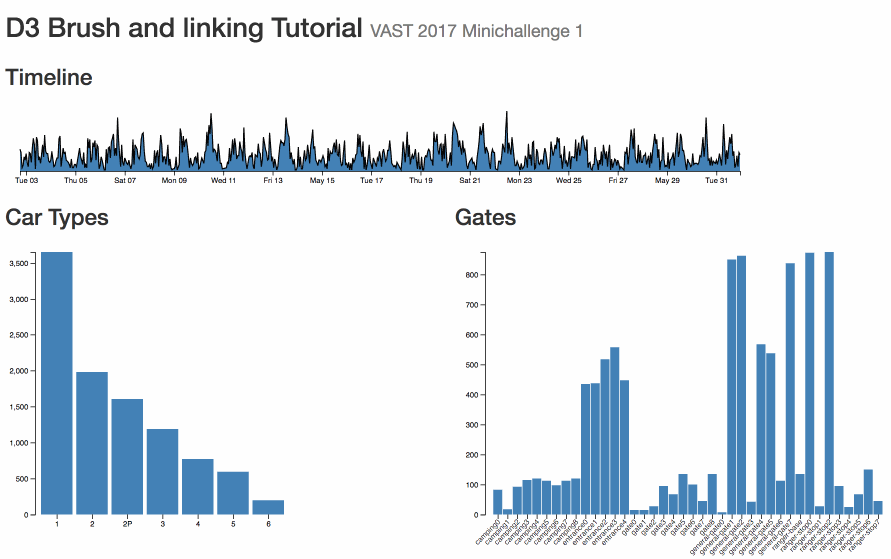

# D3 + Crossfilter Brush and Linking Tutorial

[Demo](http://johnguerra.co/viz/d3BrushAndLinking/)
[Video](https://www.youtube.com/watch?v=Oz3U38oOcNg)



A step by step tutorial on how to do brushing and linking on d3

D3 Brush and Linking Tutorial

This tutorial uses a github repository with releases. You can find them all here:

https://github.com/john-guerra/d3BrushAndLinkingExample/releases

You can download each zip manually, or you can use git to access them, just clone the repository with 
```
git clone https://github.com/john-guerra/d3BrushAndLinkingExample/releases
```
And then download the specific step using 
```
git checkout tags/step_0
```
Changing of course to the step you want. Try completing each task with your partner, but if you feel stuck feel free to download the next step

In this tutorial we are going to build a D3 visualization using the VAST 2017 Challenge Dataset (mini challenge 1) . You can get the data here

## Step 0 Boilerplate

Get the boilerplate that includes three d3 components built on this tutorial

## Step 1 Bootstrap

We are going to create three visualizations, one timeline and two barcharts (car types and gates), let's use Bootstrap to distribute them on the screen.

## Step 2 Get the Data

In this tutorial we are going to build a D3 visualization using the VAST 2017 Challenge Dataset (mini challenge 1) . You can get the data here, specifically we would use the smaller slice, as the full data could take too long to load on the browser

## Step 3 Use the modularized charts

Create three charts for the timeline, the car types, and the gate names. Then load the data from the csv file, compute binnings for the timeline (every hour), for the car types and the gate names. And show these results on three charts.

For loading the data remember that you can use
```
d3.csv("csvfile.csv", function (err, data) {
	If (err) throw err;
	// do something with the data
});
```
You can use the modularized charts in this way
```
// Create the chart
var tsChart = timeSeriesChart()
.x(function (d) { return d.attrib_for_x; }
.y(function (d) { return d.attrib_for_y; };
// Display the chart on a selection with some data
d3.select("#timeline")
	.datum(data)
	.call(Chart);
```
For binning the data, you can use the crossfilter library, that allows you to extract binnings and compute dynamic filters in a very convenient way. To use the library you do the following
```
// Create a crossfilter out of the data
var csData = crossfilter(data);

// Specify on what attributes you want to be able to filter

csData.dimTime = csData.dimension(function (d) { return d.time; });
csData.dimName = csData.dimension(function (d) { return d.name; });

// Specify on do you want to bin

csData.timeHours = csData.dimTime.group(d3.timeHour); // group by hour
csData.names = csData.dimName.group(); //just group by name

// With this you can get the actual data using .top(n) or .all()
// csData.timeHours.all()  -> Returns an array of objects with key and value with the bin counts by hour
// csData.names.all()  -> Same but the counts by name
```

## Step 4 Add hover interactions

Add hover interactions on the barcharts, such than when the user move the mouse one bar the other charts update.

With the crossfilter, you can use the filter function on any dimension to filter the data to include only records including the specified value on that dimension. Then after than the .top() or .all() functions of all the methods on the crossfilter would return only matching items. Example

```
csData.dimName.filter("John"); // we only care for records about John

cs.timeHours.all(); // Will the binned counts by hours of records including John
```
## Step 5 Add a d3.brush to the timeline

Add a brush to them time, so users can select a segment of the timeline and update the other charts. You can use d3.brush

Here is a good example of d3.brush https://bl.ocks.org/mbostock/6232537

To make the d3 brush work, you need to add a new svg g to the front of your visualization, and then call d3.brush on it. You can do this on the timeSeriesChart by appending a new g on the gEnter
```
gEnter.append("g").attr("class", "brush");
```
Right after the axis, and then call the brush later in the update part

```
g.select(".brush").call(d3.brushX()
        .extent([
          [0,0],
          [xScale.range()[1], yScale.range()[0]]
        ])
        .on("brush", brushed)
      );
```

Finally, you will need a brushed function that is going to get called everytime the brush updates
```
  function brushed() {
    if (!d3.event.sourceEvent) return; // Only transition after input.
    if (!d3.event.selection) return; // Ignore empty selections.
    var selection = d3.event.selection.map(xScale.invert);

    onBrushed(selection);
  }
```  

As you can see the d3.event.selection contains the range selected by the brush (in pixels), and with the xScale.invert we are transforming that selection into the time domain


## Extra activities

Try adding this:

Create scatter plot that shows gates vs car types, and add brush and linking.
Create new barcharts that shows counts by days of the week, and hours of the day, and link them too.
Create a heatmap that shows days of the week vs hours of the day, and also link it.


